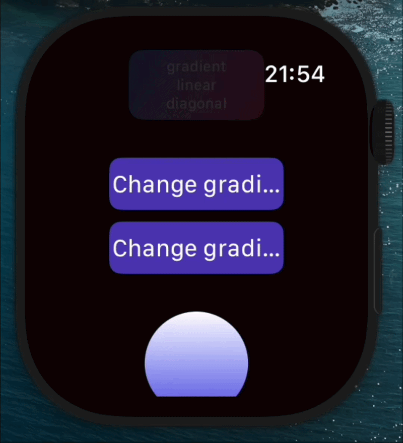
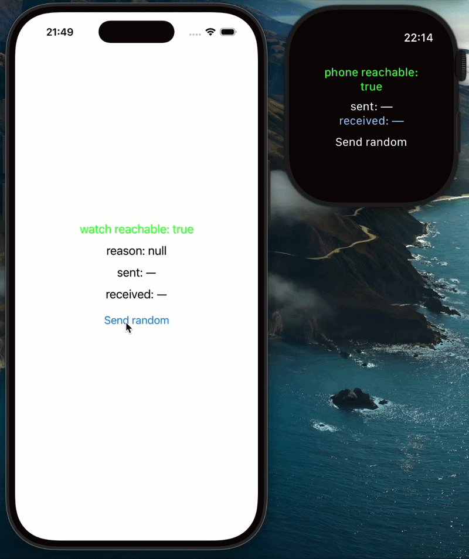

# wrst

**Build smartwatch apps with React and TypeScript - for Wear OS and Apple Watch.**

Write React-style components in TypeScript once and run them on both **Wear OS**
(Jetpack Compose) and **Apple Watch** (SwiftUI). Reactive state, effects,
navigation, `fetch`, and live reload - the developer experience you already know,
on the wrist.

> **Status: early but real.** wrst works end-to-end today - you can develop and
> ship release builds on both platforms. It's an MVP: the API is small and still
> evolving, and not everything is battle-tested yet. Feedback and issues are very
> welcome.

## Live Reload - enjoy instant changes without rebuilding ⚡



## Create Companion App with React Native 📱 ↔️ ⌚



## Why wrst

- 📱 **One codebase, two platforms** - Wear OS and Apple Watch from the same TypeScript.
- ⚛️ **React-style** - components, `useState`, `useEffect`, navigation. No new mental model.
- ⚡ **Live reload** - save and see the change on the watch instantly.
- 🤝 **Standalone _or_ companion** - ship a self-contained watch app, or pair it with a phone app. Designed to work alongside **React Native**, with a phone↔watch messaging API.

## Installation

```sh
npx wrst init my-app        # scaffold a project (src/, apple-watch/, wear-os/)
cd my-app
npm install
npm start                   # start the dev server + live reload
```

Then, in another terminal, run it on a watch:

```sh
npm run run:apple-watch     # boots a watchOS simulator, builds, installs, launches
npm run run:wear-os         # boots a Wear OS emulator, builds, installs, launches
```

Edit `src/App.tsx` and it reloads on the watch as you save.

## Sample code

```tsx
import { Component, VerticalView, Text, Button, useState } from "wrst";

const App: Component = () => {
  const [count, setCount] = useState(0);

  return (
    <VerticalView
      style={{
        width: "fill",
        height: "fill",
        horizontalAlignment: "center",
        verticalAlignment: "center",
      }}
    >
      <Text style={{ color: "#fff" }}>{`Count: ${count}`}</Text>
      <Button onPress={() => setCount(count + 1)}>
        <Text style={{ color: "#fff" }}>Increment</Text>
      </Button>
    </VerticalView>
  );
};

export default App;
```

## Companion mode (with React Native)

Already have a React Native phone app? Add a watch app to it and message between
phone and watch:

```sh
npx wrst init --companion .   # run inside your RN project
```

## License

MIT. Contributions and feedback welcome 🙌 open an issue or PR 🚀
